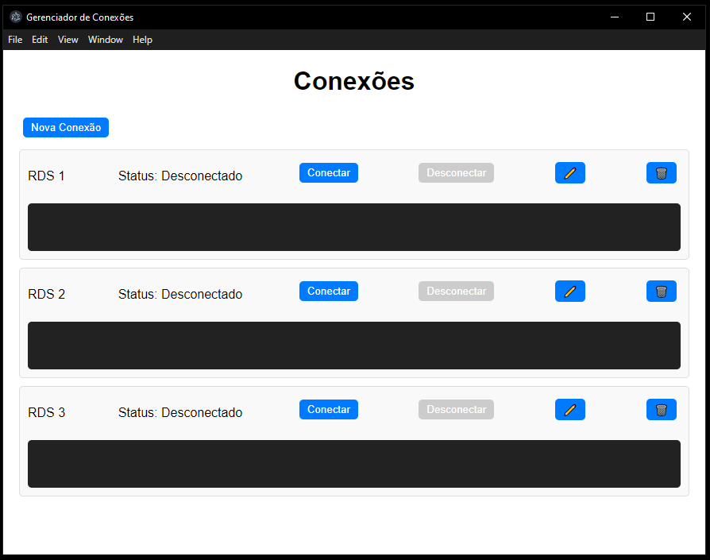
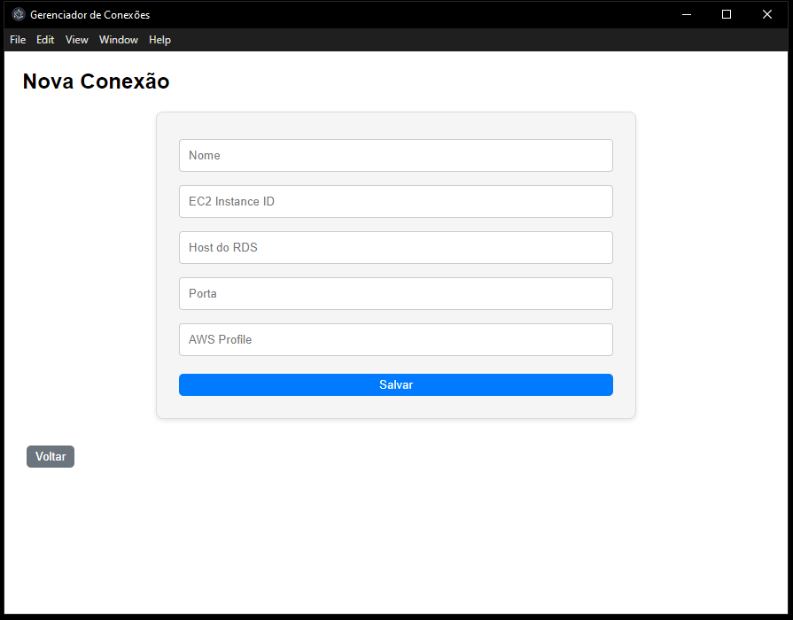

# Chatbot Personalizado com AWS Bedrock
Utilizando AWS Bedrock para Construção de Chat com IA Generativa com Conteúdos Incorporados

### 📋 Pré-requisitos

```
Node v20+
AWS CLI v2
Conta AWS com credenciais configuradas (AWS_ACCESS_KEY_ID, AWS_SECRET_ACCESS_KEY, AWS_REGION)

```

### 🔧 Instalação

```
npm install
```

### ⚙️ Executando 

Para gerar o build do .exe do app
```
npm electron-builder
```

### 🛠️ Construído com

* [Electron v33](https://www.electronjs.org/blog/electron-33-0)

### Explicação

## Problema
Para conectar a um RDS em subnet privada através de softwares como DBeaver, era necessário:

- Criar uma EC2 em subnet pública como Bastion Host.
- Gerenciar chaves SSH para autenticação.
- Criar um túnel SSH manual no terminal ligando o RDS à EC2 e ao usuário.

Essa abordagem aumenta a complexidade operacional e expõe riscos de segurança.

Solução
Para melhorar a segurança e eliminar o uso de chaves SSH, a EC2 foi movida para uma subnet privada, substituindo a conexão SSH pelo uso do AWS Session Manager.

O app Electron foi criado para automatizar a abertura de conexões no terminal entre a EC2, o RDS e o usuário, permitindo que todo o processo seja feito com poucos cliques.

## Previews


